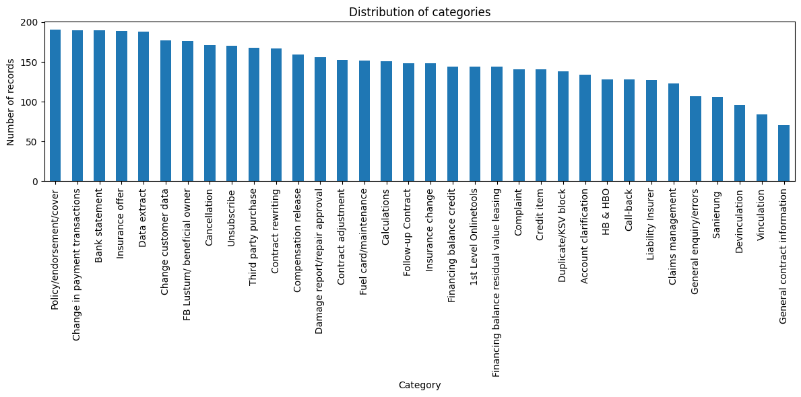

# Email categorization

This web application is designed to automatically classify email texts into 34 distinct categories. To achieve this, a BERT-based model was trained on a dataset of 5,000 emails, with 4,500 emails used for training and 500 emails reserved for testing. The trained model demonstrates strong performance, achieving a weighted F1-score of 0.88 on the test set, providing reliable and accurate email categorization.

## Project structure

``` bash
email-classification/
├── frontend                            # React web app
├── server.py                           # FastAPI backend
├── model_dev/
│   ├── gbert_email_classifier_fixed    # model, tokenizer
│   ├── prepared_data                   # test/train data, label encoder
│   ├── cat_emails_v2.csv               # original dataset
│   ├── overview_data.ipynb             # notebook discovering original dataset
│   ├── train_bert.ipynb                # experiments with training
└── .gitignore
```

## Dataset
The dataset consists of 5,000 labeled emails categorized into 34 distinct classes, including:

*Financing balance credit, Third party purchase, Account clarification, Follow-up Contract, Devinculation, Credit item, Bank statement, Compensation release, Call-back, Data extract, Complaint, FB Lustum/beneficial owner, Claims management, General contract information, Financing balance residual value leasing, Duplicate/KSV block, 1st Level Onlinetools, Policy/endorsement/cover, Unsubscribe, HB & HBO, Vinculation, Insurance change, Damage report/repair approval, Contract rewriting, Contract adjustment, Insurance offer, Change customer data, Cancellation, Change in payment transactions, General enquiry/errors, Fuel card/maintenance, Calculations, Sanierung, Liability Insurer*

The number of emails per class varies, with some classes containing around 200 emails and others around 100 emails, resulting in a class imbalance. 

Key statistics of the dataset:
- Imbalance Ratio: 2.69
- Mean count per class: 147.06
- Standard deviation: 30.52

The train-test split was performed to preserve the original class distribution, ensuring that all classes are represented in the same proportions in the training set (4,500 emails) and the test set (500 emails).

## Model

The email classifier is a fine-tuned German BERT model ([deepset/gbert-base](https://huggingface.co/deepset/gbert-base)) implemented with the Hugging Face Trainer API. The training setup was designed for stable validation-based selection and reproducibility. The trainer monitors macro F1 and automatically restores the best checkpoint.

Key settings (concise)
- Max sequence length: 256
- Train batch size: 8 (eval batch size: 16)
- Epochs: 3–4
- Learning rate: 2e-5
- Optimizer: AdamW (weight decay = 0.01)
- Warmup ratio: 0.06

Classification report is available [here](srcForREADME/classification_report.txt)

**Results**

Overall the model demonstrates performance with accuracy ≈ 0.88 and macro F1 ≈ 0.88, indicating good generalisation across the 34 categories. Two classes - “Financing balance credit” and “Financing balance residual value leasing” - show comparatively lower F1-scores (0.60 and 0.67). This underperformance is likely attributable to limited support for these classes and class imbalance in the dataset.

## How to run

1. Download [gelectra_email_classifier.zip](https://drive.google.com/file/d/1VWfrqYZ4kSm8PJ6EfwRZXlRmUHX9KV5y/view?usp=share_link) and unarchive in *model_dev* directory

2. Run the backend

``` bash
uvicorn server:app --reload
```

This starts FastAPI at http://localhost:8000.

> Make sure you have fastapi, torch, transformers, uvicorn installed. Unless run the command ```pip install fastapi torch transformers uvicorn```

3. Run web app

Install dependencies:

```bash
npm install --prefix frontend
```

Start the frontend in development mode:

```bash
npm run dev --prefix frontend
```

By default, it will be available at http://localhost:5173

## Additional info

To run Jupyter Notebook scripts to train the model you should have transformers library version less than 4.51 (I used 4.42) unless you will have troubles with training argument 'evaluation_strategy' which is not available in the newest version.